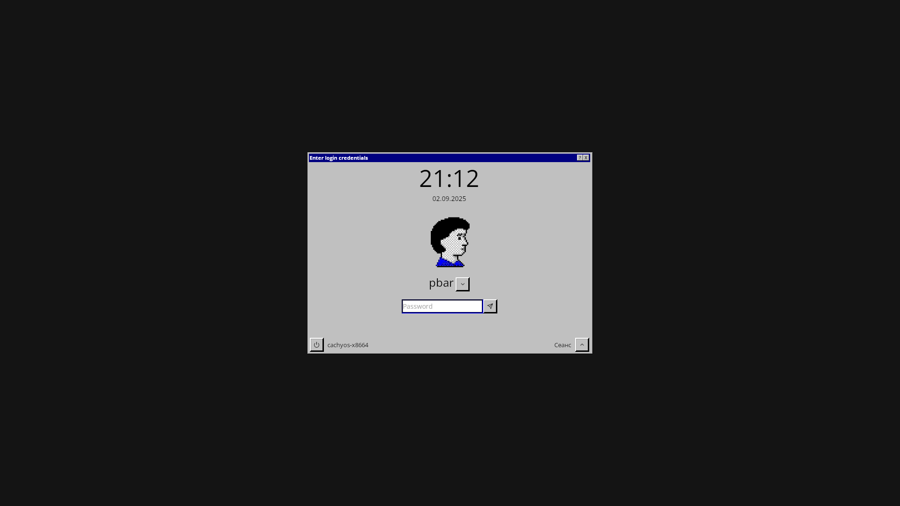

# chicago95-modern

Created based on [lightdm-evo](https://github.com/AlphaNecron/lightdm-evo)

A modern version of the Chicago95 theme for lightdm-webkit2-greeter.

## Requirements

- lightdm-webkit2-greeter

## Installation

1. Clone the repository

```bash
git clone https://github.com/pbarovsky/chicago95-modern.git
```

2. Copy theme folder

```bash
sudo cp -r chicago95-modern /usr/share/lightdm-webkit/themes/chicago95-modern
```

3. Edit lightdm-webkit2-greeter config

```bash
sudo nano /etc/lightdm/lightdm-webkit2-greeter.conf
```

4. Edit `webkit_theme` field in config

```bash
webkit_theme = chicago95-modern
```

## Screenshots


